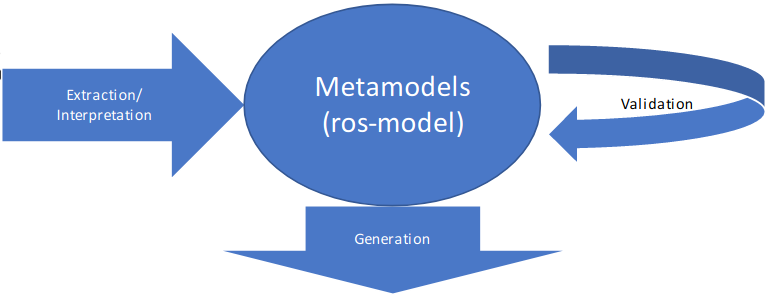

This repository contains examples of generic extensions for RosTooling. The ROStooling toolchain comprises a series of tools, plugins and scripts developed to facilitate the use of [ros-model](http://github.com/ipa320/ros-model), a family of DSLs for the formal description of components and systems developed for the ROS (Robot Operating System) framework. 

The following diagram shows the overview of the RosTooling blocks: 



Within this repository you can find documentation and example of extensions to contribute to RosTooling by developing plugins for each of its blocks. With this concept we aim to establish a federative development process to extend the tooling, which means that anyone can contribute by adding new functionalities to RosTooling but without modifying the core. 

Content:
 * [GENERATION EXTENSIONS](#generation-extensions)
 * [VALIDATION EXTENSIONS](#validation-extensions)
 * [EXTRACTION AND INTERPRETATION EXTENSIONS](#extraction-and-interpretation-extensions)
 * [METAMODELS EXTENSIONS](#metamodels-extensions)

### GENERATION EXTENSIONS
Xtext is designed to easily extend the functionality of a compiler to generate new files. Therefore the ROSTooling extension with new generators is the simplest of all its extensions, and probably the most useful.
In this repository you can find a template of a standalone plugin for code generation from a .ros model, this is under [de.fraunhofer.ipa.ros.extragenerator](templates/de.fraunhofer.ipa.ros.extragenerator/).

The template can be used as is, the user only has to modify the following files to adapt it:
- [plugin.xml](templates/de.fraunhofer.ipa.ros.extragenerator/plugin.xml): This file is the one that defines the new plugin for the Eclipse IDE. The one stored in this repository is defined to be activated by a right-click on .ros (defined in [line 40](https://github.com/ipa320/ros-model-extensions/blob/master/templates/de.fraunhofer.ipa.ros.extragenerator/plugin.xml#L40)) files imported to the tooling. The text showed on the right click menu can be defined in the [line 16](https://github.com/ipa320/ros-model-extensions/blob/master/templates/de.fraunhofer.ipa.ros.extragenerator/plugin.xml#L16).
- [GeneratorHandler.java](templates/de.fraunhofer.ipa.ros.extragenerator/src/de/fraunhofer/ipa/ros/extragenerator/GeneratorHandler.java): the generator Handler is the standard IHandler examples for eclipse environment. The function [execute](https://github.com/ipa320/ros-model-extensions/blob/master/templates/de.fraunhofer.ipa.ros.extragenerator/src/de/fraunhofer/ipa/ros/extragenerator/GeneratorHandler.java) implements the action that will be trigger when the button is pressed. In this example case, the plugin read the selected file, parser it and call the function [doGenerate](https://github.com/ipa320/ros-model-extensions/blob/master/templates/de.fraunhofer.ipa.ros.extragenerator/src/de/fraunhofer/ipa/ros/extragenerator/RosgeneratorExtra.xtend#L34) from the generator class.
- [RosgeneratorExtra.xtend](templates/de.fraunhofer.ipa.ros.extragenerator/src/de/fraunhofer/ipa/ros/extragenerator/RosgeneratorExtra.xtend) This Xtend file is the one that describe the template of the generated code. More specifically the user has only the modify the class compile to define a new template generator. Please see the following guide to learn how to use Xtend: [Writing a Code Generator With Xtend](https://www.eclipse.org/Xtext/documentation/103_domainmodelnextsteps.html#tutorial-code-generation)

### VALIDATION EXTENSIONS
Xtext is designed to easily extend the functionality of a compiler to validate new rules. Therefore the ROSTooling extension with new validator is one of the simplest of its extensions.

In this repository you can find a template of a standalone plugin for code generation from a .ros model, this is under [de.fraunhofer.ipa.ros.extravalidator](templates/de.fraunhofer.ipa.ros.extravalidator/).

The template can be used as is, the user only has to modify the following files to adapt it:
- [plugin.xml](templates/de.fraunhofer.ipa.ros.extravalidator/plugin.xml): This file is the one that defines the new plugin for the Eclipse IDE. The one stored in this repository is defined to be activated by a right-click on .ros (defined in [line 40](https://github.com/ipa320/ros-model-extensions/blob/master/templates/de.fraunhofer.ipa.ros.extravalidator/plugin.xml#L40)) files imported to the tooling. The text showed on the right click menu can be defined in the [line 16](https://github.com/ipa320/ros-model-extensions/blob/master/templates/de.fraunhofer.ipa.ros.extravalidator/plugin.xml#L16).
- [ValidatorHandler.java](templates/de.fraunhofer.ipa.ros.extragenerator/src/de/fraunhofer/ipa/ros/extragenerator/GeneratorHandler.java): the generator Handler is the standard IHandler examples for eclipse environment. The function [execute](https://github.com/ipa320/ros-model-extensions/blob/master/templates/de.fraunhofer.ipa.ros.extravalidator/src/de/fraunhofer/ipa/ros/extravalidator/ValidatorHandler.java#L58) implements the action that will be trigger when the button is pressed. In this example case, the plugin read the selected file, parser it and call the function [checkNameConventionSuffixNode](https://github.com/ipa320/ros-model-extensions/blob/master/templates/de.fraunhofer.ipa.ros.extravalidator/src/de/fraunhofer/ipa/ros/extravalidator/RosvalidatorExtra.xtend#L20) from the validator class.
- [RosvalidatorExtra.xtend](templates/de.fraunhofer.ipa.ros.extravalidator/src/de/fraunhofer/ipa/ros/extravalidator/RosvalidatorExtra.xtend) This Xtend file is the one that describe the rules. More specifically the user has only the add new check classes to add a new validation rules. Please see the following guide to learn how to use Xtend: [Creating Custom Validation Rules](https://www.eclipse.org/Xtext/documentation/103_domainmodelnextsteps.html#tutorial-validation)

### EXTRACTION AND INTERPRETATION EXTENSIONS
Since the information that will be formalized using our models can come from many different sources, there is a wide variety of possible implementations. But we have created a set of common and reusable mechanisms. The most practical of these mechanisms is a Python API that allows to generate automatically the models. The level of difficulty for the integration of this API es relatively low for developer with Python experience. 

##### Python API 

The ros_model_parser package (https://github.com/ipa320/ros_model_parser) is a Python module that connects the Xtext DSLs implementation to the Python programming language. The current version of the parser package allows the generation of components (.ros files) and system (.rossystem files) models. 

See the following simple example: 

```
from ros_model_generator.rosmodel_generator import RosModelGenerator 

from ros_metamodels.ros_metamodel_core import RosModel, Package, Node, Artifactimport rospy 

def ros_model_generator_test():
    ros_model = RosModelGenerator() 
    node = Node("test_node") 
    node.add_publisher("my_pub","std_msgs/Bool") 
    node.add_parameter("myIntParam", None, None, 25) 
    ros_model.create_model_from_node('my_ros_pkg',"test",node) 
    ros_model.generate_ros_model('/tmp/test.ros') 

if __name__ == '__main__': 
  try:
    ros_model_generator_test() 
    except rospy.ROSInterruptException: 
      pass 
```

Mainly the developer has to import the “RosModelGenerator” class and call its functions to create the attributes of the model. Once the model is completed, with the function generate_ros_model that takes as argument the full path to save the final model, the defined model will be automatically created. 

#####  M2M techniques 

EMF provides mechanisms that can be used to support migration  of data between different versions of a model (or between two different models, for that matter): 
- Use Ecore2Ecore and Ecore2XML to define a mapping between the different model(s) (versions) 
- Use Ecore2XMLExtendedMetaData with save/load options to handle unrecognized data 
- Use a resource handler to pre/post-process data that cannot be mapped automatically 

###### Ecore2Ecore Mappings: 
- Describe a mapping between two Ecore models 
- Can be created from an Ecore (*.ecore) model via the ‘Map To Ecore...’ context menu item in the Package Explorer or Resource Navigator 
- Typically used as a development-time artifact (only) 
- Can include one-to-one, one-to-many, many-to-one, many-to-many, and one-sided mappings 
- Only one-to-one and one-sided (one-to-none, none-to-one) mappings are useful for data migration 

###### Ecore2XML Mappings: 
- Describe a mapping between an Ecore model and its XML representation 
- Can be generated from an Ecore2Ecore (*.ecore2ecore) model via the ‘Generate Ecore to XML Mapping...’ context menu item in the Package Explorer or Resource Navigator 
- Often used as a run-time artifact (in conjunction with Ecore2XMLExtendedMetaData) 
- Can include one-to-one and many-to-one mappings, but only the former are useful for data migration 

###### Ecore2XMLExtendedMetaData: 
- Can be used with the OPTION_EXTENDED_META_DATA save/load option defined on XMLResource to affect how data are serialized/deserialized 
- Will consult registered Ecore2XML mappings to determine the XML representation of objects 

### METAMODELS EXTENSIONS

Unfortunately, the traditional EMF projects implementation doesn’t support an easy, not even clean, way to extend the metamodels. The only solution we can suggest is to include one of our metamodels while creating a new ecore file and link its attributes. For the Xtext implementation we recommend to set only references to the fields from our models. But unfortunately, this method is not a real language extension.
