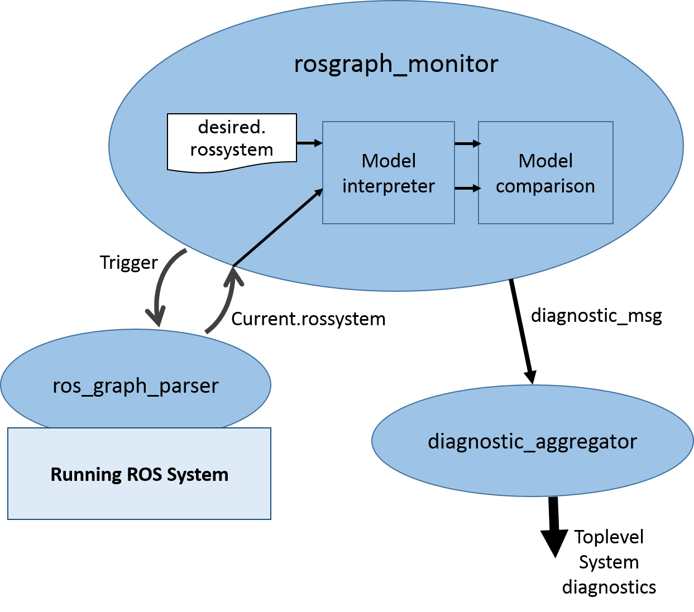

## EXTRACTION AND INTERPRETATION EXTENSIONS

- [Core component](#core-component)
- [Developer perspective and profile](#developer-perspective-and-profile)
- [Concept for extension](#concept-for-extension)
- [Available examples and tutorials](#available-examples-and-tutorials)

### Core component
This section includes all those extensions that allow to create either automatically, semi-automatically or manually models that conform to the rules of the ros-model constituent DSLs.  

### Developer perspective and profile
Since the information that will be formalized using our models can come from many different sources, there is a wide variety of possible implementations. But we have created a set of common and reusable mechanisms. The most practical of these mechanisms is a Python API that allows to generate automatically the models. The level of difficulty for the integration of this API es relatively low for developer with Python experience.

### Concept for extension

#### Python API

The ros_model_parser package (https://github.com/ipa320/ros_model_parser) is a Python module that connects the Xtext DSLs implementation to the Python programming language. The current version of the parser package allows the generation of components (.ros files) and system (.rossystem files) models.

See the following simple example:

```
from ros_model_generator.rosmodel_generator import RosModelGenerator
from ros_metamodels.ros_metamodel_core import RosModel, Package, Node, Artifactimport rospy
def ros_model_generator_test():     ros_model = RosModelGenerator()

    node = Node("test_node")
    node.add_publisher("my_pub","std_msgs/Bool")
    node.add_parameter("myIntParam", None, None, 25)
    ros_model.create_model_from_node('my_ros_pkg',"test",node)
    ros_model.generate_ros_model('/tmp/test.ros')

if __name__ == '__main__':

    try:    ros_model_generator_test()
    except rospy.ROSInterruptException:
      	  pass
```

Mainly the developer has to import the “RosModelGenerator” class and call its functions to create the attributes of the model. Once the model is completed, with the function generate_ros_model that takes as argument the full path to save the final model, the defined model will be automatically created.

#### M2M techniques

EMF provides mechanisms that can be used to support migration  of data between different versions of a model (or between two different models, for that matter):

- Use Ecore2Ecore and Ecore2XML to define a mapping between the different model(s) (versions)
- Use Ecore2XMLExtendedMetaData with save/load options to handle unrecognized data
- Use a resource handler to pre/post-process data that cannot be mapped automatically

Ecore2Ecore Mappings:

- Describe a mapping between two Ecore models
- Can be created from an Ecore (*.ecore) model via the ‘Map To Ecore...’ context menu item in the Package Explorer or Resource Navigator
- Typically used as a development-time artifact (only)
- Can include one-to-one, one-to-many, many-to-one, many-to-many, and one-sided mappings
- Only one-to-one and one-sided (one-to-none, none-to-one) mappings are useful for data migration

Ecore2XML Mappings:

- Describe a mapping between an Ecore model and its XML representation
- Can be generated from an Ecore2Ecore (*.ecore2ecore) model via the ‘Generate Ecore to XML Mapping...’ context menu item in the Package Explorer or Resource Navigator
- Often used as a run-time artifact (in conjunction with Ecore2XMLExtendedMetaData)
- Can include one-to-one and many-to-one mappings, but only the former are useful for data migration

Ecore2XMLExtendedMetaData:

- Can be used with the OPTION_EXTENDED_META_DATA save/load option defined on XMLResource to affect how data are serialized/deserialized
- ´Will consult registered Ecore2XML mappings to determine the XML representation of objects

#### Leveraging existing parsers to ros-model

The URDF file is parsed with urdf_parser_py (https://github.com/ros/urdf_parser_py), which parses the XML elements as [xml.etree.ElementTree](https://docs.python.org/3/library/xml.etree.elementtree.html). It is based on the XML tags, corresponding URDF objects are instantiated.

The top-level URDF object is Robot which consists of child elements like links and joints.

This Robot object is passed to the kinematics model generator, which iterates through the children and dumps the DSL grammar text for each element.

<font color="green">… to be completed.. </font>


### Available examples and tutorials

- M2M from other MDE approaches (using EMF)

For the project [SeRoNet](https://www.seronet-projekt.de/) a M2M conversion was created to automatically convert the ros-models to SeRoNet native components models. The source code of the full implementation and the documentation is publicly online under: [SeRoNet-Tooling-ROS-Mixed-Port](https://github.com/seronet-project/SeRoNet-Tooling-ROS-Mixed-Port).


- Static code analysis (using analyzers like HAROS)

HAROS is a framework for static code analysis, in this case our plugin uses the result of the analysis to find the communication interfaces of each ROS node and directly translate it into our model structure, which can be validated or used to compose it with other nodes forming a system,

The repository [ros-model-extractors](https://github.com/ipa320/ros-model-extractors) holds a set of ROS containers where you can easily do the analysis for different distros without the need to install locally the necessary software. These containers take as input argument the URL of the GitHub repository that contains the code.

A single [Python script](https://github.com/ipa320/ros-model-extractors/blob/main/ros_model_extractor.py) is the responsible of call HAROS to analyze and get the result of the analysis. Then it [calls the Python API for ros-model](https://github.com/ipa320/ros-model-extractors/blob/main/ros_model_extractor.py#L118) to auto-generate the corresponding models.

- Runtime interpreters

The package [rosgraph_monitor](https://github.com/ipa320/rosgraph_monitor) contains a set of observers to assist in system monitoring tasks. One of these observers uses ros-model to diagnose whether during system execution all nodes defined at design time are present. The following diagram summarizes the architecture of the approach:



The ros_graph_parser running together with the target system and thanks to the [rosgraph library](http://wiki.ros.org/rosgraph) extract the list of nodes running and the interfaces they offer. The parser then calls the ros-model Python implementation to convert the information found into a rossystem model. See the source code of the [graph_observer.py](https://github.com/ipa320/rosgraph_monitor/blob/main/src/rosgraph_monitor/observers/graph_observer.py).

Once we have the model of the running system (Current.rossystem) we compare it with the model that describe our desired system (desired.rossystem). The module to compare these two models is available as part of the Python API library for ros-model ([source code](https://github.com/ipa320/ros_model_parser/blob/master/src/ros_model_parser/model_comparator.py)).

The instructions about how to run this software are up-to-date under: [ROS system diagnostics](https://github.com/ipa320/rosgraph_monitor#ros-system-diagnostics)


- Parsers from other "models" (i.e., URDF)

<font color="green"> extra??</font>
- URDF parser (python) links to generator (single library)
- Import URDF parser which uses existing libraries with additional API and then call the kinematics_model_generator (python) to generate kinematics model file (model-to-model using python).
