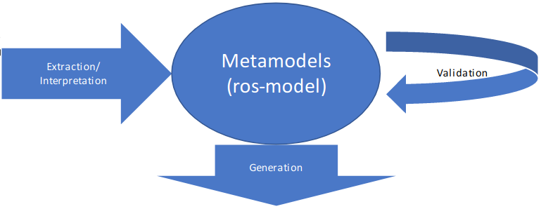

# Welcome to the RosTooling manual

The ROStooling toolchain comprises a series of tools, plugins and scripts developed to facilitate the use of ros-model, a family of DSLs for the formal description of components and systems developed for the ROS (Robot Operating System) framework.

The following diagram shows the overview of the RosTooling blocks:

The purpose of this document is to describe the extension options of RosTooling by developing plugins for each of its blocks.  

With this concept we aim to establish a federative development process to extend the tooling, which means that anyone can contribute by adding new functionalities to RosTooling but without modifying the core.

The following sections that go through all the blocks one by one are organized as follows, a first sub-section defines how the main module is developed, the it continues with the developer's perspective and the knowledges required to develop an extension as well as an estimation of the difficulty. In the next sub-section we analyze the technical possibilities that exist for extensibility, finally each section ends with, if available, a list of existing extensions that can be used as examples or templates.

- [METAMODELS (ROS-MODEL) EXTENSIONS](metamodel_extensions.md)
- [EXTRACTION AND INTERPRETATION EXTENSIONS](extraction_extensions.md)
- [VALIDATION EXTENSIONS](validation_extensions.md)
- [GENERATION EXTENSIONS](generation_extensions.md)
