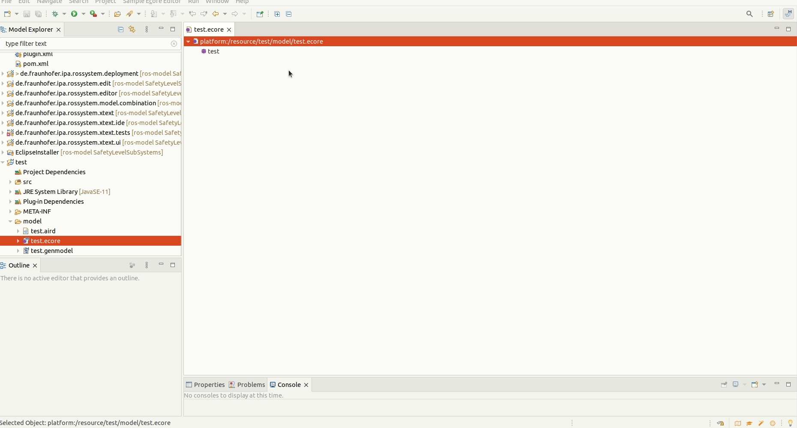

## METAMODELS (ROS-MODEL) EXTENSIONS

- [Core component](#core-component)
- [Developer perspective and profile](#developer-perspective-and-profile)
- [Concept for extension](#concept-for-extension)
- [Available examples and tutorials](#available-examples-and-tutorials)

### Core component

Ros-model is composed by a family of metamodels, described by Ecore files, and their derivated DSLs, written using the format Xtext.  

The metamodels that constitute ros-model are:

- [PrimitivesTypes.ecore](https://github.com/ipa320/ros-model/blob/master/plugins/de.fraunhofer.ipa.ros/model/PrimitivesTypes.ecore)
- [Ros.ecore](https://github.com/ipa320/ros-model/blob/master/plugins/de.fraunhofer.ipa.ros/model/ros.ecore)
- [ComponentInterface.ecore](https://github.com/ipa320/ros-model/blob/master/plugins/de.fraunhofer.ipa.componentInterface/model/componentInterface.ecore) - it will be deprecated -
- [Rossystem.ecore](https://github.com/ipa320/ros-model/blob/master/plugins/de.fraunhofer.ipa.rossystem/model/rossystem.ecore)
- [Urdf.ecore](https://github.com/ipa320/kinematics-model/blob/main/de.fraunhofer.ipa.kinematics/model/urdf.ecore)
- [Xacro.ecore](https://github.com/ipa320/kinematics-model/blob/main/de.fraunhofer.ipa.kinematics/model/xacro.ecore)

Each of them has an associated Xtext project, where the DSLs grammar, the validators rules and the compiler engines are implemented.

### Developer perspective and profile

For the development of an extension plugin for the metamodels and languages, the developer requires a good knowledge of the [Eclipse Modelling Framework](https://www.eclipse.org/modeling/emf/) and [Xtext](https://www.eclipse.org/Xtext/). The level of difficulty of the development of this type of extensions is high.

### Concept for extension

Unfortunately, the traditional EMF projects implementation doesn’t support an easy, not even clean, way to extend the metamodels. Alternatively, what we recommend is to include one of our models to use its attributes. This type of plugin will have a dependency on the RosTooling core.

#### Include and link a ros metamodel or DSL

The only solution we can suggest is to include one of our metamodels while creating a new ecore file and link its attributes. For the Xtext implementation we recommend to set only references to the fields from our models. But unfortunately, this method is not a real language extension.

To include one of the ros-model metamodels, the developer must open the new metamodel, right click on the main class of it and then select "Load resource...". A new dialog will pop-up and allow the user to select the path to the ecore file to be included.

Once this is done all the attributes of the metamodel, rossystem for the previous example, will be available to be referenced. The Xtext project can now be created using the standard way (see the [official documentation](https://www.eclipse.org/Xtext/documentation/102_domainmodelwalkthrough.html)), the links and references will be automatically handle.

For further information, please take a look at the following documentation: [Extending an EMF ecore model inheritance](https://www.vogella.com/tutorials/EclipseEMF/article.html#extending-an-emf-ecore-model-inheritance).

#### Extend a ros metamodel or DSL

NOT RECOMMENDED

This is doable but complex (Ecore+Xtext+Xtend). The Xtext part will very likely duplicate a lot of code. 

### Available examples and tutorials

#### Include and link a ros metamodel or DSL

… to be done, deployment model …. 

#### Extend a ros metamodel or DSL

NO EXAMPLES AVAILABLE OR PLANNED
